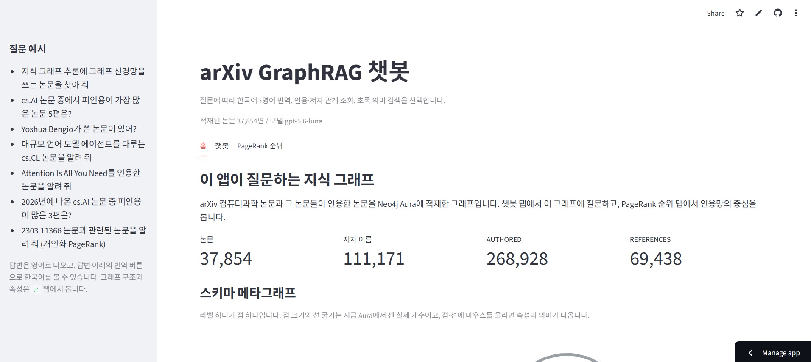
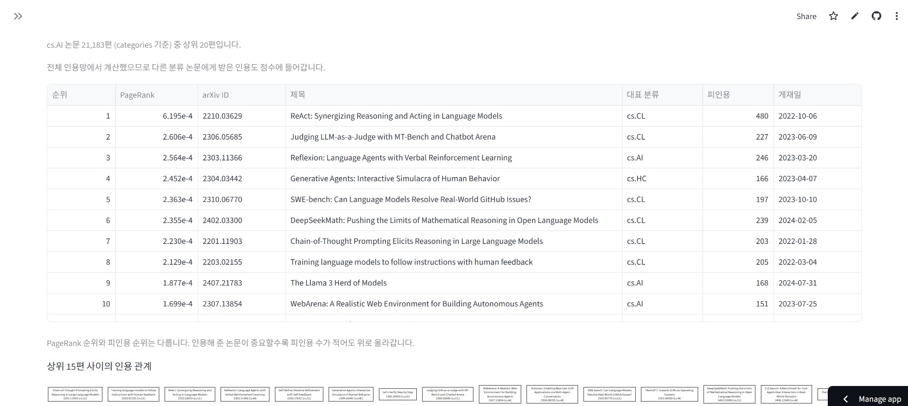

# arXiv GraphRAG Streamlit 앱

Neo4j Aura에 적재한 arXiv 지식 그래프에 자연어로 질문하는 Streamlit 앱의 기술 문서입니다.
한국어 질문을 영어로 번역해 **Text2Cypher 관계 조회**와 **초록 벡터 검색**을 선택적으로 실행하고,
답변에 쓴 근거를 arXiv ID로 검증해 그래프와 함께 보여 줍니다.

프로젝트 전체 소개(데이터 수집, 온톨로지, 품질 리포트, 데모 화면)는 [`README.md`](README.md)에 있습니다.

---

## 목차

- [arXiv GraphRAG Streamlit 앱](#arxiv-graphrag-streamlit-앱)
  - [목차](#목차)
  - [빠른 시작](#빠른-시작)
    - [요구 사항](#요구-사항)
    - [실행](#실행)
    - [환경 변수](#환경-변수)
  - [아키텍처](#아키텍처)
    - [모듈 구성](#모듈-구성)
    - [질문 처리 흐름](#질문-처리-흐름)
  - [화면](#화면)
    - [홈 탭](#홈-탭)
    - [챗봇 탭](#챗봇-탭)
      - [검색된 그래프](#검색된-그래프)
      - [추가 기능](#추가-기능)
    - [PageRank 순위 탭](#pagerank-순위-탭)
  - [에이전트](#에이전트)
    - [에이전트 도구](#에이전트-도구)
    - [답변 형식과 근거 검증](#답변-형식과-근거-검증)
  - [검색 알고리즘](#검색-알고리즘)
    - [벡터 검색](#벡터-검색)
    - [Text2Cypher 검색](#text2cypher-검색)
    - [PageRank](#pagerank)
    - [개인화 PageRank](#개인화-pagerank)
    - [언제 무엇이 쓰이나](#언제-무엇이-쓰이나)

---

## 빠른 시작

### 요구 사항

| 항목 | 값 |
|---|---|
| Python | 3.12 이상 |
| 그래프 | [`notebooks/arxiv_ai_kg_to_aura.ipynb`](notebooks/arxiv_ai_kg_to_aura.ipynb)로 적재를 끝낸 Aura 인스턴스 |
| 벡터 인덱스 | `arxiv_paper_embedding_index` (`ONLINE` 상태) |
| 선택 | [`notebooks/aura_graph_rag_quality_report.ipynb`](notebooks/aura_graph_rag_quality_report.ipynb)가 만든 `reports/aura_graph_rag_quality_report.json` — 홈 탭의 커뮤니티 메타그래프에 필요합니다 |

### 실행

저장소 루트에서 실행합니다.

```bash
uv sync
uv run streamlit run app.py --server.fileWatcherType none
```

`--server.fileWatcherType none`은 이 환경의 `torch` 같은 패키지에서 나는 파일 감시 에러를 막습니다.
코드를 고친 뒤에는 앱을 다시 실행합니다.

### 환경 변수

저장소 루트 `.env`를 `python-dotenv`로 읽습니다. 적재 노트북과 같은 키입니다.

| 환경변수 | 필수 | 용도 |
|---|---|---|
| `NEO4J_URI` | ✅ | Aura 연결 URI (`neo4j+s://…`) |
| `NEO4J_USER` 또는 `NEO4J_USERNAME` | ✅ | 사용자명 |
| `NEO4J_PASSWORD` | ✅ | 비밀번호 |
| `OPENAI_API_KEY` | ✅ | 임베딩·LLM API 키 |
| `NEO4J_DATABASE` | | 생략하면 `neo4j` |
| `OPENAI_MODEL` | | 생략하면 `gpt-5.6-luna` |
| `CLIENT_ID`·`CLIENT_SECRET` | | Aura API 자격증명. GDS 세션 엔진을 쓸 때만 필요합니다 |
| `AURA_PROJECT_ID` | | Aura 프로젝트가 둘 이상일 때만 지정합니다 |

질문 임베딩은 적재 때와 같은 `text-embedding-3-large` **768차원**이고, 저장된 논문 벡터는 다시 만들지
않습니다. 준비 단계에서 벡터 인덱스가 `ONLINE`이 아니면 에러로 알리고 멈춥니다.

---

## 아키텍처

### 모듈 구성

| 파일 | 역할 | 로드 시점 |
|---|---|---|
| [`chatbot.py`](chatbot.py) | 연결·인덱스 확인 → 도구 4개 → 에이전트 → 답변 검증 → PageRank 계산 | 앱 시작 시 1회 |
| [`app.py`](app.py) | 세 탭의 화면 구성과 상태 관리 | 매 렌더 |
| [`metagraph.py`](metagraph.py) | 홈 탭의 Plotly 메타그래프(스키마·커뮤니티) | 홈 탭 렌더 시 |
| [`gds_pagerank.py`](gds_pagerank.py) | (선택) Aura Graph Analytics 세션 PageRank 엔진 | GDS 엔진을 고를 때만 |

`chatbot.py`는 함수를 정의한 뒤 마지막 준비 코드에서 드라이버·검색기·에이전트를 한 번 만들고,
`app.py`의 `@st.cache_resource`가 이 모듈을 브라우저 세션 사이에 재사용합니다.
`gds_pagerank.py`는 함수 안에서 지연 임포트하므로, GDS 엔진을 고르기 전에는 Aura API에 접속조차 하지 않습니다.

### 질문 처리 흐름

```text
질문(한국어)
  └─ translate_to_english          비영어일 때만
       └─ search_graph  (Text2Cypher 관계 조회)   ─┐
       └─ search_papers (초록 벡터 검색)          ─┤ 필요한 것만, 둘 다 가능
            └─ rank_related_papers (개인화 PageRank)
                 └─ GroundedAnswer{answer, evidence_ids}
                      └─ 인용 ID 검증 → 실패 시 1회 재작성
                           └─ 화면: 답변 · 근거 그래프 · 접이식 근거
```

---

## 화면

세 탭입니다: **홈** · **챗봇** · **PageRank 순위**.

### 홈 탭



**스키마 메타그래프** — 라벨 하나가 점 하나입니다. 점 크기와 선 굵기는 화면을 열 때 Aura에서 직접 센
실제 개수이고, 점·선에 마우스를 올리면 속성과 관계 방향이 나옵니다. `REFERENCES`는 논문끼리의
관계라 자기참조 고리로 그립니다. `ArxivPaper의 속성` 표에 속성별 타입과 뜻을 적어 두었습니다.

**커뮤니티 메타그래프** — [`notebooks/aura_graph_rag_quality_report.ipynb`](notebooks/aura_graph_rag_quality_report.ipynb)의
`plot_community_metagraph`(matplotlib)를 Plotly로 옮긴 것입니다. Leiden 커뮤니티 하나가 점 하나,
점 크기는 논문 수, 선 굵기는 두 커뮤니티 사이의 상호 인용 수입니다. 배치 시드도 노트북과 같은 42라
그림이 실행마다 같습니다.

커뮤니티 계산에는 GDS가 필요하므로 앱에서 다시 돌리지 않고, 그 노트북이 저장한
`reports/aura_graph_rag_quality_report.json`을 읽어 그립니다. 그 파일이 없으면 스키마 메타그래프만
나오고 노트북을 실행하라는 안내가 뜹니다. PageRank 순위는 겹치지 않도록 전용 탭에만 둡니다.

### 챗봇 탭

질문 하나에 대해 화면이 위에서부터 이렇게 쌓입니다.

| 순서 | 내용 |
|---|---|
| 1 | **도구 선택 표시** — `한국어→영어 번역 / 벡터 의미 검색 / Text2Cypher / 개인화 PageRank`의 선택 여부. 실제 호출 기록에서 읽으므로 짐작이 아닙니다 |
| 2 | **검색어 번역** — `검색어 번역: <원문> → <영어>`. 번역 도구를 썼을 때만 |
| 3 | **답변** — 영어 본문 + `근거 arXiv ID` + 번역 버튼 |
| 4 | **검색된 그래프** — 아래 [검색된 그래프](#검색된-그래프) 참고 |
| 5 | **추가  기능** — 아래 [추가 기능](#추가-기능) 참고 |

답변은 기본이 영어입니다. `🇰🇷 한국어로 번역`을 누르면 같은 답변의 한국어 번역으로 바뀌고
`🇺🇸 영어 원문 보기`로 되돌아옵니다. 번역은 답변마다 따로 기억하고 한 번만 호출합니다.

#### 검색된 그래프

답변이 인용한 논문(없으면 이번에 검색한 논문)을 **최대 15편**까지 다시 조회해 그립니다.

- **실선 `REFERENCES`** — 그린 논문들 **사이에** 저장된 인용 관계입니다. 밖으로 나가는 인용은 그리지 않습니다.
- **점선 `AUTHORED`** — 저장된 저자 표기 연결입니다. 논문마다 3명까지 보이고 나머지는 `저자 N명 더`로 묶습니다.
- 논문이 **6편을 넘으면** 글자가 작아지지 않도록 저자를 생략하고 논문과 인용 관계만 그립니다.
- 그림은 검색한 근거의 **범위**를 보여 줍니다. 실제로 인용한 논문은 답변 아래의 arXiv ID로 확인합니다.

#### 추가 기능

첫 칸은 항상 나오고, 나머지 셋은 해당 결과가 있을 때만 나옵니다.

<details>
<summary><b><code>검색 과정과 근거 확인</code> — 항상</b></summary>

- **답변의 인용 arXiv ID** — 답변 아래에 붙은 근거 ID를 목록으로 다시 보여 줍니다.
- **도구 요청 순서** — 실제 호출 기록을 번호 순으로 나열합니다. 이름은 한국어로 바꿔 적습니다
  (`한국어→영어 번역`, `Text2Cypher 관계 조회`, `벡터 의미 검색`, `개인화 PageRank`).
  도구마다 무엇을 넘겼는지도 함께 적습니다 — 번역은 `번역할 문장`, 벡터 검색은 `검색어`,
  개인화 PageRank는 `시드 논문`.
- **도구 응답** — 호출마다 성공·실패 상태와 도구가 돌려준 값 원본입니다.
- **실행한 Cypher** — Text2Cypher를 쓴 경우 쿼리 전문과 결과 행 표입니다.
- **Cypher 오류(에이전트가 다시 작성함)** — 문법이 틀린 쿼리를 썼다가 고쳐 부른 경우 그 오류가
  남습니다. 대화는 끊기지 않으므로 여기서만 그 시도를 확인할 수 있습니다.

</details>

<details>
<summary><b><code>개인화 PageRank로 찾은 관련 논문</code> — 관련 논문을 찾았을 때</b></summary>

표 한 장입니다: **순위 · PageRank · arXiv ID · 제목 · 대표 분류 · 피인용 · 게재일**.
PageRank 점수는 1e-4 수준이라 지수 표기로 보여 줍니다.
이 순위는 전체에서 유명한 논문이 아니라 **시드 논문 주변에서** 중요한 논문입니다.

</details>

<details>
<summary><b><code>벡터로 찾은 논문의 초록</code> — 벡터 의미 검색을 썼을 때</b></summary>

찾은 논문마다 네 줄입니다.

1. `arXiv ID · 제목`
2. `Neo4j 벡터 유사도: 0.xxx (클수록 유사함) / 분류: cs.AI, cs.LG`
3. **초록 전문**
4. `arXiv PDF` 링크 버튼

</details>

<details>
<summary><b><code>그래프에 그린 논문</code> — 그래프에 그린 논문이 있을 때</b></summary>

바로 위 `검색된 그래프`에 실제로 그려진 논문만 표로 정리합니다:
**arXiv ID · 제목 · 대표 분류 · 게재일 · 저자 수 · 피인용 · 인용 · 출처**.
`저자 수`는 그림에서 `저자 N명 더`로 접힌 수까지 포함한 전체이고,
`출처`는 `ai`(수집한 논문)인지 `reference`(인용으로 딸려온 논문)인지입니다.

</details>

### PageRank 순위 탭



`cs.AI` 한 분류만 다룹니다(분류 코드는 `app.py`의 `CATEGORY` 상수).

| 설정 | 뜻 |
|---|---|
| 전체 인용망에서 계산한 뒤 cs.AI만 남기기 | 다른 분류에서 받은 인용도 점수에 들어갑니다. **전체에서의 중요도** |
| cs.AI 논문끼리의 인용만으로 계산하기 | 양 끝이 모두 cs.AI인 인용만 남깁니다. **이 분야 안에서의 중요도** |
| 부가 분류까지 포함 | 끄면 `primary_category`만(10,847편), 켜면 `categories` 기준(21,183편) |

두 방식 모두 1위는 ReAct(`2210.03629`)이지만 3위부터 갈립니다. 전체 기준에서는 Reflexion이,
분야 안 기준에서는 DeepSeekMath가 올라옵니다. PageRank 순위는 피인용 순위와 다릅니다 —
중요한 논문에게 인용받으면 피인용 수가 적어도 위로 갑니다.
표 아래에는 상위 논문들 **사이의** 인용 관계를 그래프로 그립니다.

직접 계산 엔진은 인용망을 처음 쓸 때만 읽으므로 `인용망 불러오고 PageRank 계산` 버튼을 두었습니다.
챗봇 탭을 쓰려고 앱을 열었을 때 20초를 기다리지 않게 하려는 것입니다.
GDS 엔진을 고르면 이 행렬을 아예 만들지 않고 필요한 수치를 Cypher로 셉니다.

---

## 에이전트

`chatbot.py`가 LangChain `create_agent`로 만든 에이전트 하나가 도구 네 개를 들고 질문을 처리합니다.
어떤 도구를 몇 번 부를지는 에이전트가 정하고, 화면에는 **실제 호출 기록**만 표시합니다.

### 에이전트 도구

| 도구 | 인수 | 하는 일 |
|---|---|---|
| `translate_to_english` | `text` | 한국어 등 비영어 입력을 영어 검색어로 번역합니다. 검색 근거가 아닙니다 |
| `search_graph` | `cypher` | 조회 전용 Cypher를 실행해 저자·인용·분류·기간 관계를 읽습니다 |
| `search_papers` | `query`, `top_k` | 제목+초록 임베딩으로 의미가 가까운 논문을 최대 10편 찾습니다 |
| `rank_related_papers` | `arxiv_ids`, `top_k` | 개인화 PageRank로 그 논문과 인용망에서 가까운 논문을 찾습니다 |

그래프의 제목·초록·저자 이름·분류 코드가 모두 영어라서, 한국어 질문은 검색 전에 번역해야 합니다.
그래서 `select_names`(이름 확인) 대신 번역 도구를 넣었습니다.

**Cypher 작성 규칙**

- `search_graph`는 `EXPLAIN`으로 실행 계획을 먼저 확인해 **조회 전용 쿼리만** 실행합니다.
  쓰기 쿼리는 거부하고, 문법 오류는 예외 대신 `error` 값으로 돌려주어 에이전트가 고쳐 다시 부릅니다.
- 매개변수(`$param`)는 쓰지 않습니다. 에이전트가 값을 Cypher 문자열 안에 직접 넣습니다.
- 분류는 노드가 아니라 속성입니다. 대표 분류는 `p.primary_category = "cs.AI"`(인덱스),
  부가 분류까지 포함하면 `"cs.AI" IN p.categories`(전체 훑기)입니다.

### 답변 형식과 근거 검증

LLM의 최종 출력은 두 필드입니다(`ProviderStrategy(GroundedAnswer, strict=True)`).

| 필드 | 내용 |
|---|---|
| `answer` | 검색 근거로 작성한 **영어** 답변 문자열 |
| `evidence_ids` | 답변에 사용한 `ArxivPaper.arxiv_id` 목록 |

`ask`는 `agent.stream(..., stream_mode=["messages", "values"])`로 생성 중인 답변을 받아 화면을 바로
갱신하고, 생성이 끝나면 **이번 질문의 호출 기록만** 모아 인용 ID를 검사합니다. 검색 결과에 없는 ID가
있으면 같은 근거로 한 번 수정하고 다시 검사합니다. 계속 실패하면 답변을 대화에 저장하지 않습니다.

> **ID가 존재하는지만 보는 검사입니다.** 답변 내용이 맞는지까지 판정하지 않으므로,
> 근거 표와 초록으로 직접 대조하세요.

Cypher는 `answer_value`(답할 값)와 `evidence_ids`(그 값의 근거 `arxiv_id` 목록)를 반환해야 합니다.
논문을 특정할 수 없는 순수 집계라면 두 곳 모두 빈 목록이어도 됩니다.

---

## 검색 알고리즘

네 가지를 씁니다. 앞의 둘은 **논문을 찾는** 방식이고, 뒤의 둘은 찾은 논문을 **인용망에서 줄 세우는**
방식입니다. 서로 대체하는 관계가 아니라 질문에 따라 조합됩니다.

### 벡터 검색

의미가 가까운 논문을 찾습니다. 단어가 달라도 주제가 같으면 걸립니다.

**색인(적재 때 한 번)** — 논문마다 제목과 초록을 이어 붙인 문자열을 `text-embedding-3-large`로
**768차원** 벡터로 만들어 `ArxivPaper.embedding`에 저장하고, 코사인 거리 벡터 인덱스
`arxiv_paper_embedding_index`를 걸어 두었습니다.

**질의(앱에서 매번)** — 영어 질의문만 같은 모델·차원으로 임베딩하고, `neo4j-graphrag`의
`VectorRetriever`가 인덱스에서 가장 가까운 `top_k`편을 가져옵니다. **저장된 논문 벡터는 다시 만들지
않습니다.** `top_k`는 1~10이고 기본값은 5입니다.

돌려주는 값은 `arxiv_id`, 제목, 초록, 대표 분류, 분류 목록, PDF 링크, 그리고 **코사인 유사도 점수**
입니다. 점수는 클수록 가깝습니다.

> **한계** — 분류·기간·저자 같은 조건은 걸 수 없고, 결과가 **절대 비지 않습니다.** 무엇을 넣든 가장
> 가까운 N편을 돌려주므로, 없는 주제를 물어도 무언가는 나옵니다. 그래서 분류를 좁혀야 하는 질문은
> 에이전트가 Text2Cypher를 함께 씁니다.

### Text2Cypher 검색

저장된 관계와 속성을 **정확히** 세거나 거릅니다. "몇 편", "가장 많이", "누가 썼나", "언제 이후"처럼
조건과 집계가 있는 질문이 여기에 해당합니다.

에이전트는 시스템 프롬프트로 받은 **그래프 스키마와 작성 규칙**을 보고 Cypher를 직접 씁니다.
`search_graph(cypher)`가 그 문자열을 받아 실행합니다.

```text
에이전트가 작성한 Cypher
  └─ EXPLAIN 으로 실행 계획 확인 (15초 제한)
       ├─ query_type 이 "r"(읽기 전용)이 아니면  → 거부
       └─ 읽기 전용이면 실제 실행 (30초 제한)
            ├─ 성공 → cypher + rows 반환
            └─ 문법 오류 → 예외 대신 error 값 반환 → 에이전트가 고쳐 다시 호출
```

쓰기 쿼리가 물리적으로 차단되고, 문법 오류가 대화를 끊지 않는 것이 핵심입니다.
결과 행은 `answer_value`(답할 값)와 `evidence_ids`(근거 `arxiv_id` 목록)를 반드시 포함해야 하며,
`LIMIT 25` 이하로 끝내도록 규칙을 걸어 두었습니다.

> **한계** — 이름 표기가 정확해야 합니다. `toLower(...) CONTAINS ...`로 부분 일치를 쓰지만,
> 의미가 비슷한 논문을 찾아 주지는 못합니다. 그 역할은 벡터 검색이 맡습니다.

### PageRank

인용망 **전체에서** 어떤 논문이 중요한지 매깁니다. `PageRank 순위` 탭이 이 값을 씁니다.

대상 그래프는 `(:ArxivPaper)-[:REFERENCES]->(:ArxivPaper)`이고, **인용하는 쪽에서 인용된 쪽으로**
방향이 있습니다. 점수는 그 방향을 따라 흐르므로 인용을 받을수록 쌓입니다.

계산은 멱승법입니다.

1. 인용망을 행 정규화한 전이 행렬로 만듭니다. 논문이 인용을 `d`개 하면 각 이웃에 `1/d`씩 나눠 줍니다.
2. 매 반복마다 점수의 **85%(감쇠 계수 `0.85`)** 는 인용을 따라 흐르고, **15%** 는 텔레포트 분포로
   되돌아갑니다. 전역 PageRank의 텔레포트는 모든 논문에 **균등**합니다.
3. 나가는 인용이 없는 논문(dangling)에 고인 점수는 사라지지 않게 텔레포트 분포로 다시 뿌립니다.
4. 점수 변화량이 `1e-11` 미만이 되거나 **200회**를 채우면 멈춥니다.

점수는 **합이 1이 되게 정규화**되어 있어 1e-4 수준입니다. 화면에서 지수 표기로 보여 주는 이유입니다.

**피인용 수와 다릅니다.** 피인용은 몇 번 인용됐는지만 세지만, PageRank는 **인용해 준 논문이 얼마나
중요한지**까지 반영합니다. 그래서 피인용이 적어도 중요한 논문에게 인용받으면 위로 올라갑니다.

계산 엔진은 앱의 `scipy` 희소 행렬(기본)과 Aura GDS 세션 둘 중에 고를 수 있고, **두 엔진의 순위는
같습니다**(`cs.AI`·`cs.LO`에서 상위 5편 일치 확인). 점수 눈금만 달라 숫자를 직접 비교하면 안 됩니다.

### 개인화 PageRank

전역 PageRank가 "전체에서 유명한 논문"을 뽑는다면, 개인화 PageRank는 **특정 논문 주변에서**
중요한 논문을 뽑습니다. 챗봇 탭의 `rank_related_papers`가 이 방식입니다.

전역 PageRank와 같은 멱승법을 쓰되 **두 가지를 바꿉니다.**

| | 전역 PageRank | 개인화 PageRank |
|---|---|---|
| 텔레포트 | 모든 논문에 균등 | **시드 논문에만** 몰아줌(시드가 n편이면 각 `1/n`) |
| 그래프 방향 | 인용 방향 그대로 | **무방향** |

**텔레포트를 시드에 몰아주는 이유** — 15%의 점수가 매번 시드로 되돌아오므로, 시드에서 인용을 따라
몇 걸음 안에 닿는 논문일수록 점수가 높게 유지됩니다. 멀리 있는 유명 논문은 되돌아오는 흐름을 받지
못해 밀려납니다.

**무방향으로 바꾸는 이유** — 인용 방향을 그대로 두면 점수가 시드가 **인용한** 논문 쪽으로만
흘러갑니다. 관련 논문을 찾는 것이 목적이므로, 인용한 쪽과 인용받은 쪽을 모두 이웃으로 봅니다.
구현은 각 인용을 양방향으로 넣고 중복 쌍을 한 번만 남기는 방식입니다.

결과에서 **시드 논문 자신은 제외**하고, 점수가 0인 논문(시드와 인용으로 이어지지 않은 논문)도
버립니다. 그래서 인용 관계가 저장되지 않은 논문을 시드로 주면 결과가 비고, 그 사실을 답변에 적습니다.

예: `2303.11366`(Reflexion)을 시드로 주면 ReAct, Toolformer, Self-Refine, Voyager,
Generative Agents 순으로 나옵니다. 전역 PageRank 상위권과는 겹치는 부분이 있지만,
`1910.10045`(XAI 서베이)를 시드로 주면 설명가능성 논문들만 나오고 전역 상위권과는 겹치지 않습니다.

에이전트는 답변이 특정 논문을 중심으로 할 때 이 도구를 부릅니다. 사용자가 논문을 지목한 경우뿐
아니라 **주제로 검색해 찾은 논문에 대해서도** 상위 3편을 시드로 넣습니다. 순수 집계(편수·분류 전체
순위·저자 목록)에서는 부르지 않습니다. 질문마다 도는 기능이라 **항상 직접 계산**을 씁니다.

### 언제 무엇이 쓰이나

| 질문 유형 | 쓰이는 방식 |
|---|---|
| "~를 다루는 논문 찾아 줘" | 벡터 검색 → 찾은 논문으로 개인화 PageRank |
| "cs.AI 논문 중 피인용 top 5" | Text2Cypher (집계·정렬) |
| "~를 다루는 cs.CL 논문" | 벡터 검색 + Text2Cypher (분류 조건은 벡터로 못 걸어서) |
| "이 논문과 관련된 논문" | 개인화 PageRank |
| "이 분야에서 중요한 논문" | 전역 PageRank (`PageRank 순위` 탭) |

한국어 질문이면 위 어느 경우든 `translate_to_english`가 먼저 돕니다.
