# arXiv GraphRAG

arXiv AI 논문을 구조화된 지식 그래프로 만들고, 그래프 탐색·벡터 검색·PageRank를 결합한 GraphRAG 프로젝트입니다.

[](https://www.python.org/)
[](https://neo4j.com/cloud/aura/)
[](https://streamlit.io/)

🌐 **Live demo:** [arXiv GraphRAG Streamlit 앱](https://arxivgraphrag-nxuoq53irzeuzpqgdtkeun.streamlit.app/)

## Overview

최근 3개월의 arXiv Computer Science AI 논문과 해당 논문이 인용한 1-hop 참고문헌을 수집해 Neo4j Aura에 적재했습니다. Streamlit 앱은 질문에 따라 한국어→영어 번역, Text2Cypher 관계 조회, 제목·초록 벡터 검색, 개인화 PageRank를 조합해 답변과 근거를 제공합니다.

> Streamlit 앱의 탭·도구별 상세 기능과 PageRank 계산 방식은 [`APP_README.md`](APP_README.md)를 참고하세요.

### 핵심 기능

- 저자·논문·인용 관계를 조회하는 GraphRAG 질의
- 제목과 abstract 기반 768차원 벡터 검색
- 질문 논문 주변의 관련 문헌을 찾는 개인화 PageRank
- PageRank 순위, 커뮤니티, 스키마 메타그래프 시각화
- 답변에 사용된 arXiv ID·Cypher·도구 호출 순서 확인

## Architecture

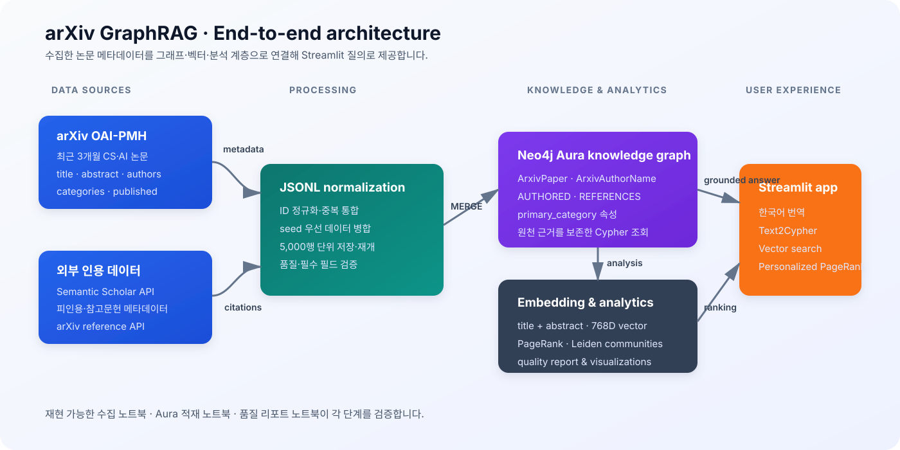

```text
arXiv OAI-PMH ──┐
                 ├─> JSONL 정규화 ──> Neo4j Aura 지식 그래프
Semantic Scholar ┘                         │
                                           ├─> 768D 임베딩·벡터 인덱스
                                           ├─> Text2Cypher 관계 질의
                                           └─> Streamlit GraphRAG 앱
```

처리 흐름은 `논문 수집 → 인용·참고문헌 수집 → 메타데이터 결합 → Aura 적재 → 임베딩·검색 → 품질 검증` 순서입니다.

## Quick start

### Requirements

- Python 3.12+
- `uv`
- Neo4j Aura 접속 정보
- OpenAI API 키

### Run

프로젝트 루트에 `.env`를 만들고 `NEO4J_URI`, `NEO4J_USER` 또는 `NEO4J_USERNAME`, `NEO4J_PASSWORD`, `OPENAI_API_KEY`를 설정합니다.

```bash
uv sync
uv run streamlit run app.py
```

앱은 `홈`, `챗봇`, `PageRank 순위` 탭을 제공합니다. 앱의 상세 설정과 오류 대응은 [`APP_README.md`](APP_README.md)에 정리했습니다.

배포된 앱은 [Streamlit 데모 주소](https://arxivgraphrag-nxuoq53irzeuzpqgdtkeun.streamlit.app/)에서 바로 확인할 수 있습니다.

## Data

`old` 폴더는 제외하고 현재 프로젝트의 JSONL과 노트북을 기준으로 설명합니다.

| 데이터 | 경로 | 내용 |
| --- | --- | --- |
| AI 논문 | `data/ai/arxiv_cs_recent_3months_oai_part1~2.jsonl` | 최근 3개월 AI 논문 **6,467건**. 제목, abstract, 저자, 분류, 발행일, DOI, PDF URL 포함 |
| 인용 원천 | `data/citations_ai/arxiv_citations_part1~2.jsonl` | AI 논문별 Semantic Scholar 인용·참고문헌 메타데이터 |
| 참고문헌 논문 | `data/ai_references/arxiv_ai_references_api/arxiv_ai_references_api_part1~7.jsonl` | AI 논문이 인용한 논문 메타데이터 **31,913행** 및 `cit_arxiv_id` 목록 |

동일한 arXiv ID는 하나의 논문으로 통합합니다. 적재 결과는 논문 **37,854개**, 저자 이름 **111,171개**, `AUTHORED` **268,928개**, `REFERENCES` **69,438개**입니다.

### 실행 노트북 파일

- [`arxiv_computer_science_recent_3months_to_jsonl_oai_pmh.ipynb`](notebooks/arxiv_computer_science_recent_3months_to_jsonl_oai_pmh.ipynb) — arXiv OAI-PMH에서 CS 메타데이터를 수집하고 `published`, `primary_category`로 필터링
- [`arxiv_citations_semantic_scholar_to_jsonl.ipynb`](notebooks/arxiv_citations_semantic_scholar_to_jsonl.ipynb) — Semantic Scholar Graph API를 배치 조회해 피인용·참고문헌 목록과 인용 지표를 `data/citations_ai`에 저장
- [`arxiv_citation_references_arxiv_api_to_jsonl.ipynb`](notebooks/arxiv_citation_references_arxiv_api_to_jsonl.ipynb) — 참고문헌 arXiv ID의 메타데이터를 5,000행 단위 JSONL로 수집하고 캐시·상태 파일으로 재개
- [`arxiv_ai_kg_to_aura.ipynb`](notebooks/arxiv_ai_kg_to_aura.ipynb) — JSONL 정규화, Aura 적재, 제목+abstract 임베딩, 벡터 인덱스 생성

## Ontology

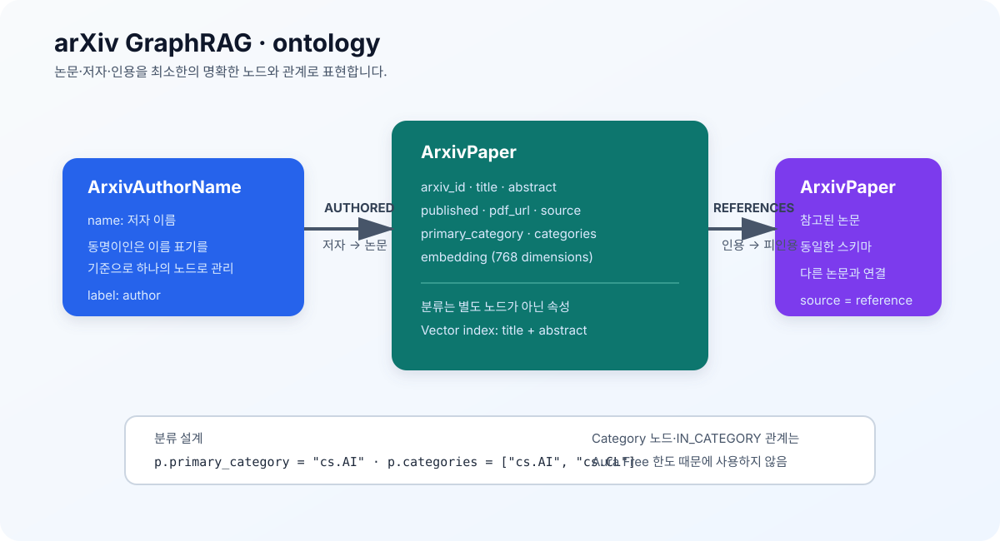

```text
(:ArxivAuthorName {name})-[:AUTHORED]->(:ArxivPaper)
(:ArxivPaper)-[:REFERENCES]->(:ArxivPaper)
```

| 요소 | 설계 |
| --- | --- |
| `ArxivPaper` | `arxiv_id`, `title`, `abstract`, `published`, `pdf_url`, `primary_category`, `categories`, `source`, `embedding` |
| `ArxivAuthorName` | 저자 이름 `name`을 식별하는 노드 |
| `AUTHORED` | 저자에서 논문으로 향하는 저술 관계 |
| `REFERENCES` | 인용 논문에서 피인용 논문으로 향하는 관계 |
| 분류 | `primary_category`, `categories` 속성으로 저장 |

Aura Free의 관계 한도와 고차수 허브 문제를 고려해 `Category` 라벨과 `IN_CATEGORY` 관계는 만들지 않았습니다. `arxiv_id`는 URL·`arXiv:` 접두어·버전 접미어를 제거해 정규화하며, 임베딩 입력은 `title + abstract`입니다.

## Knowledge graph

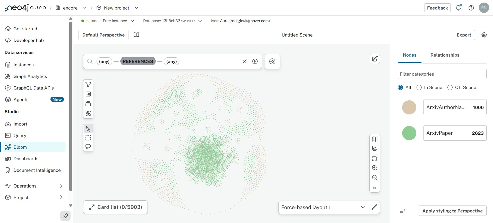

## Quality report

품질 리포트 노트북은 그래프와 원천 JSONL을 대조해 준수율·정밀도·ER 일관성을 검사하고, GDS로 PageRank와 Leiden 커뮤니티를 분석합니다.

- 분석 노트북: [`aura_graph_rag_quality_report.ipynb`](notebooks/aura_graph_rag_quality_report.ipynb)
- 결과 JSON: [`aura_graph_rag_quality_report.json`](reports/aura_graph_rag_quality_report.json)

| 지표 | 결과 |
| --- | --- |
| 스키마 준수율 | 노드·`AUTHORED`·`REFERENCES` 모두 **100%** |
| 정밀도 | 고정 시드 42, 표본 50건의 6개 사실 모두 **100%** |
| ER 일관성 | 중복 ID·필수값 누락·고아 논문·타입 오류·자기참조 **0건** |

## Community analysis

품질 리포트 노트북은 `REFERENCES` 인용망을 기반으로 Leiden 커뮤니티 탐지를 수행합니다. AuraDB Free에는 GDS가 내장되어 있지 않으므로 임시 Aura Graph Analytics 세션에서 계산하며, 원본 AuraDB에는 분석 결과를 쓰지 않습니다. 세션 설정은 2GB 메모리, TTL 30분입니다.

Leiden 분석에서는 방향성이 있는 `REFERENCES` 관계를 커뮤니티 탐지에 사용할 수 있도록 무방향 투영으로 바꿉니다. 따라서 같은 커뮤니티로 묶였다는 것은 두 논문이 같은 분류라는 뜻이 아니라, 인용망에서 서로 연결된 구조적 군집에 속한다는 의미입니다. `randomSeed=42`와 고정 레이아웃을 사용해 결과와 시각화를 재현할 수 있으며, 커뮤니티 번호 자체에는 의미가 없습니다.

리포트는 규모가 큰 상위 5개 커뮤니티의 논문 수와 최빈 `primary_category` 조합을 집계합니다.

| 커뮤니티 | 논문 수 | 대표 분류 조합 |
| --- | ---: | --- |
| C1 | 3,874 | `cs.AI` · `cs.CL` |
| C2 | 2,725 | `cs.CL` · `cs.LG` |
| C3 | 2,513 | `cs.CV` · `cs.CL` |
| C4 | 2,375 | `cs.CL` · `cs.AI` |
| C5 | 1,827 | `cs.CV` · `cs.RO` |

### 커뮤니티 크기 분포

커뮤니티별 논문 수를 큰 순서로 비교해 특정 군집에 논문이 얼마나 집중되는지 보여 줍니다. 막대의 분류 라벨은 해당 커뮤니티에서 가장 많이 나타난 주분류를 나타냅니다.

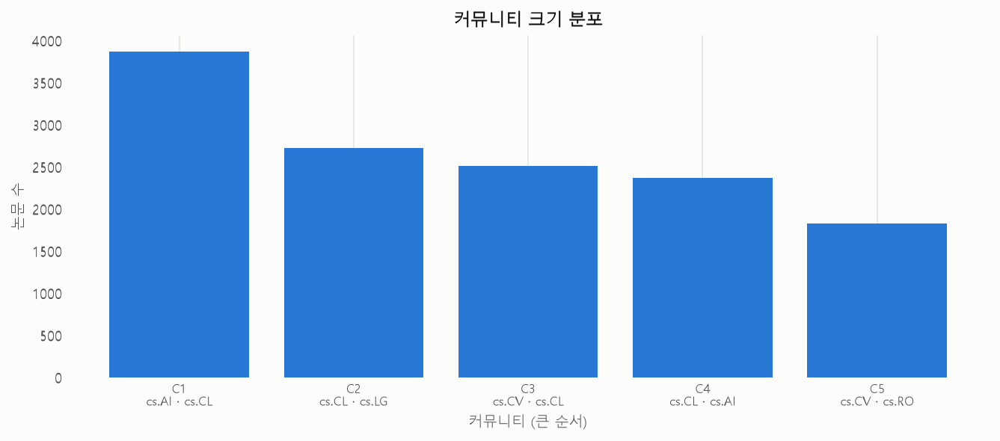

### 커뮤니티 메타그래프

각 점은 하나의 커뮤니티이며 점의 크기와 점 안 숫자는 커뮤니티의 논문 수를 뜻합니다. 선의 굵기는 두 커뮤니티 사이의 상호 `REFERENCES` 인용 흐름을 나타내므로, 인용 교류가 많은 군집과 군집 간 연결을 한눈에 확인할 수 있습니다.

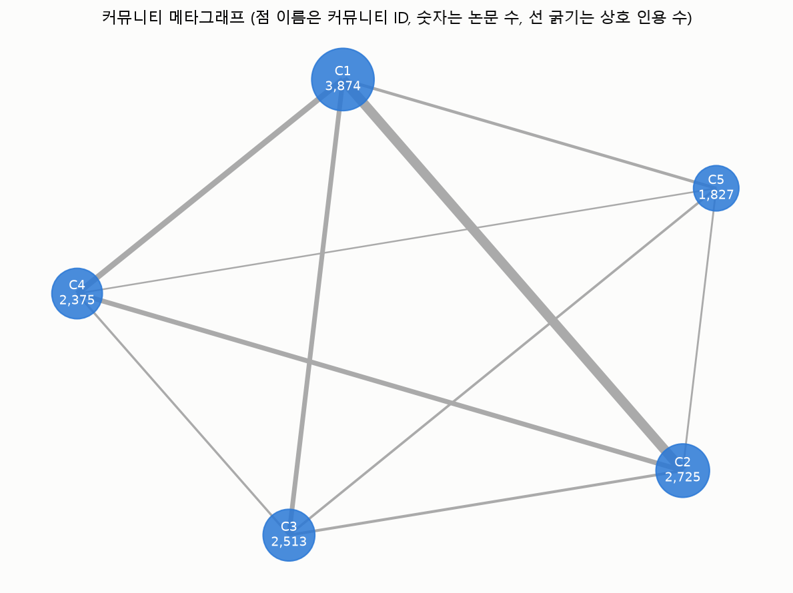

## Streamlit demo

### Home — 그래프 현황과 스키마


적재된 논문·저자·관계 수와 스키마 메타그래프를 한 화면에서 확인합니다.

### Chatbot — 의미 기반 벡터 유사도 논문 검색

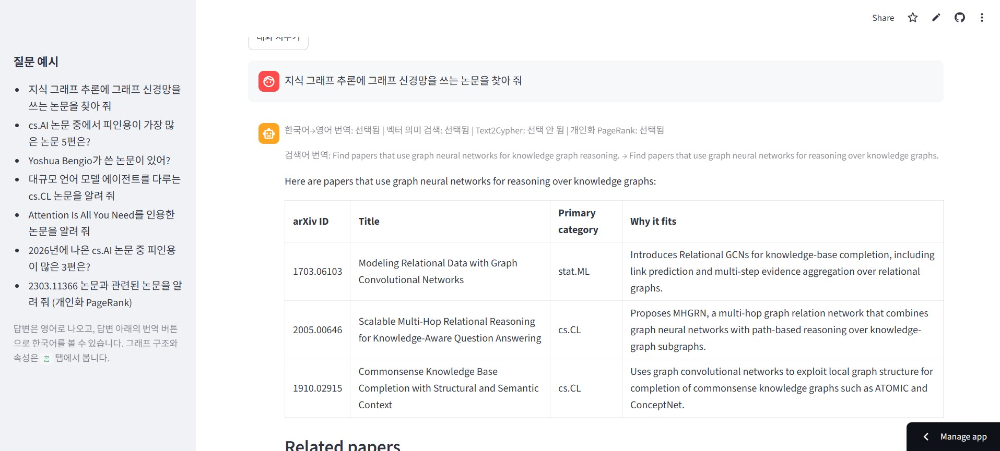

한국어 질문을 영어로 변환하고 제목·초록의 벡터 유사도로 관련 논문을 추천합니다.

### Chatbot — 개인화 PageRank 관련 논문

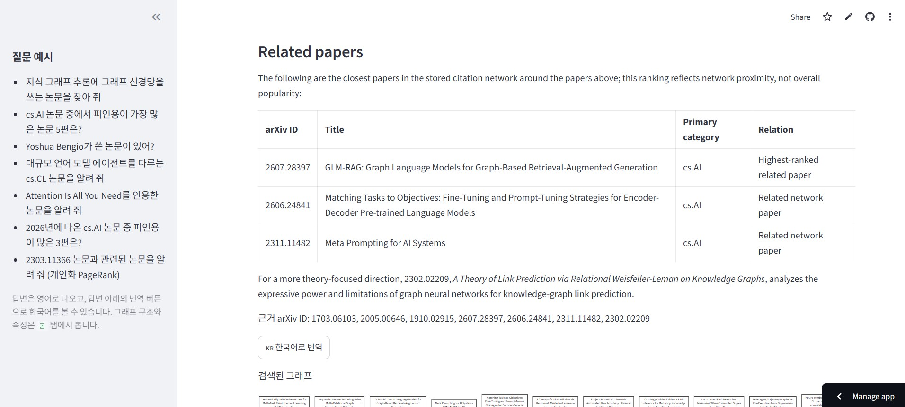

질문 또는 검색 결과 논문을 시드로 삼아 인용 네트워크에서 가까운 논문을 찾습니다.

### Chatbot — 답변 번역

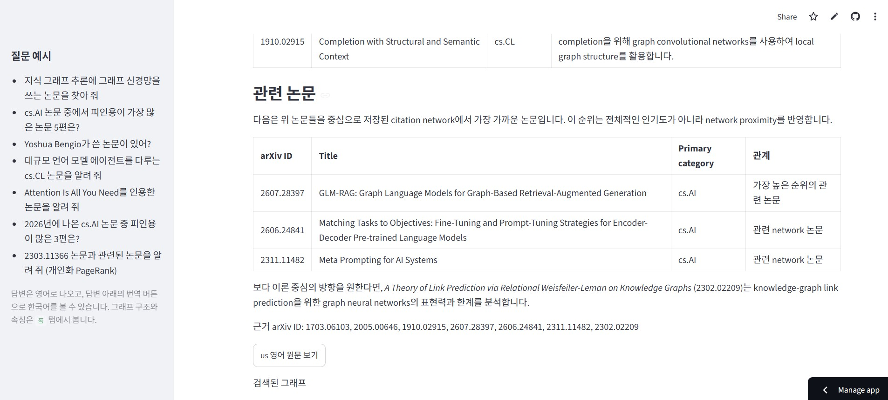

영어 답변을 한국어로 전환하고 다시 영어 원문으로 돌아갈 수 있습니다.

### Chatbot — PageRank 근거

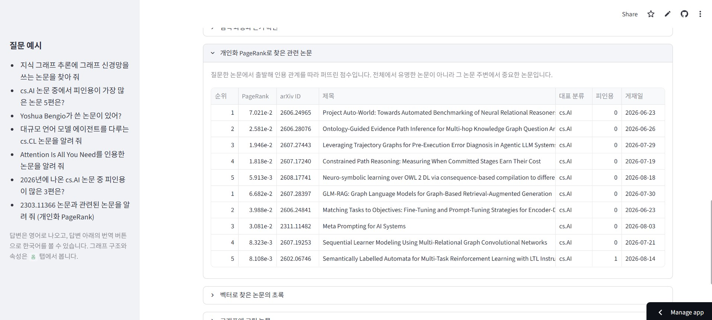

시드 논문 주변의 PageRank 점수와 논문 정보를 표로 확인합니다.

### Chatbot — Text2Cypher

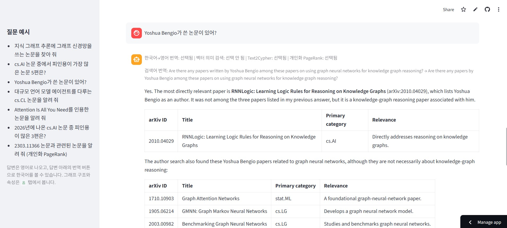

저자·논문·인용 관계를 조회 전용 Cypher로 탐색합니다.

### PageRank — 계산 조건

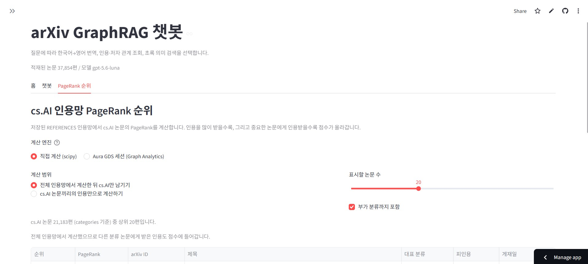

직접 계산 또는 Aura GDS를 선택하고 인용망 범위·표시 개수·부가 분류 포함 여부를 설정합니다.

### PageRank — 순위와 인용 관계


PageRank 점수·논문 정보·피인용 수를 순위표로 보고 상위 논문 간 인용 관계를 확인합니다.

### PageRank — 엔진 비교

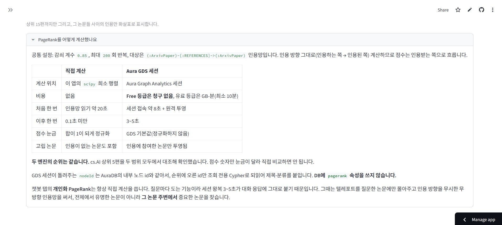

직접 계산과 Aura GDS 세션의 계산 위치·비용·속도·점수 눈금·고립 논문 처리 차이를 설명합니다.

## Project structure

```text
.
├── app.py                         # Streamlit 진입점
├── chatbot.py                     # 검색 도구·에이전트·개인화 PageRank
├── gds_pagerank.py                # Aura Graph Analytics PageRank
├── metagraph.py                  # 스키마·커뮤니티 시각화
├── APP_README.md                 # 앱 상세 문서
├── data/                         # JSONL 및 데모 이미지
├── notebooks/                    # 수집·적재·품질 분석 노트북
├── reports/                      # 품질 리포트 JSON·시각화
└── tests/                        # 노트북·수집 로직 테스트
```

## Limitations and retrospective

- Neo4j Aura Free의 노드·관계 한도 때문에 `Category` 라벨과 `IN_CATEGORY` 관계를 만들지 못하고 분류를 논문 속성으로 저장했습니다.
- 시간 제약으로 AI 외 다른 분야의 논문까지 수집하지 못했습니다.
- AI 관련 논문이 인용한 1-hop 논문만 수집해 더 깊은 인용망은 포함하지 못했습니다.
- 컴퓨터 용량 제약으로 PDF를 청킹·임베딩하지 못하고 제목과 abstract만 사용했습니다.

## Verification

README의 링크와 이미지 경로는 현재 저장소의 노트북·리포트·이미지를 기준으로 작성했습니다. 품질 수치는 [`reports/aura_graph_rag_quality_report.json`](reports/aura_graph_rag_quality_report.json)의 생성 결과를 따릅니다.
