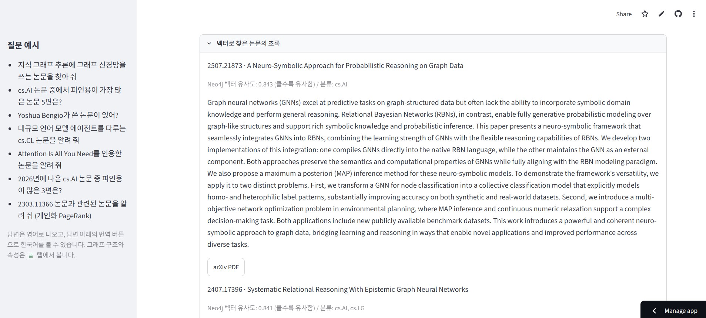

# arXiv GraphRAG

arXiv의 AI 관련 논문과 인용 관계를 Neo4j Aura에 적재하고, 그래프 관계 탐색과 벡터 검색을 결합한 GraphRAG 프로젝트입니다.  
Streamlit 앱에서는 자연어 질문에 따라 한국어→영어 번역, Text2Cypher 관계 조회, 초록 기반 벡터 검색, 개인화 PageRank를 선택하여 논문과 근거를 제시합니다.

Streamlit 앱의 실행 방법, 탭·도구별 상세 기능, PageRank 계산 방식은 [`APP_README.md`](APP_README.md)에 정리했습니다.

## 프로젝트 설명

논문 제목·초록·저자·분류·발행일·인용 관계를 구조화해 지식 그래프로 만들었습니다. 
단순 키워드 검색을 넘어 저자, 분류, 인용 네트워크를 함께 탐색하고, 검색 결과의 arXiv ID와 실행한 조회 과정을 확인할 수 있도록 구성했습니다.

```text
arXiv의 ai분류의 최근 3개월 논문 데이터 수집 → Semantic Scholar api를 이용해 인용·참고문헌 수집 → arxiv id를 이용해 인용된 논문 수집 → Neo4j Aura 적재 → 임베딩·벡터 인덱스 → GraphRAG/Streamlit 질의
```

앱을 실행하려면 프로젝트 루트에 Neo4j Aura 및 OpenAI 연결 정보를 담은 `.env`를 준비한 뒤 아래 명령을 실행합니다.

```bash
uv sync
uv run streamlit run app.py
```

## 데이터 설명


| 구분 | 파일 | 규모 및 내용 |
| --- | --- | --- |
| AI seed 논문 | `data/ai/arxiv_cs_recent_3months_oai_part1~2.jsonl` | 최근 3개월 Computer Science 논문 중 AI 관련 조건을 통과한 **6,467건**. 제목, 초록, 저자, 분류, 발행일, DOI, PDF URL을 포함합니다. |
| 인용 원천 | `data/citations_ai/arxiv_citations_part1~2.jsonl` | seed 논문의 Semantic Scholar 인용·참고문헌 메타데이터입니다. |
| 참고문헌 논문 | `data/ai_references/arxiv_ai_references_api/arxiv_ai_references_api_part1~7.jsonl` | AI seed 논문이 인용한 논문 메타데이터 **31,913행**. `cit_arxiv_id`에 해당 논문을 인용한 원 논문 ID 목록을 보관합니다. |
| 수집 캐시 | `data/ai_references/arxiv_ai_references_api/arxiv_ai_references_api_metadata_cache.jsonl` | API 재개를 위한 캐시이며, 그래프 적재에서는 중복·구형 형식을 피하기 위해 제외합니다. |

수집과 처리 과정은 다음 노트북에 재현 가능하게 기록했습니다.

- [`notebooks/arxiv_computer_science_recent_3months_to_jsonl_oai_pmh.ipynb`](notebooks/arxiv_computer_science_recent_3months_to_jsonl_oai_pmh.ipynb): arXiv OAI-PMH에서 CS 메타데이터를 수집하고 `published`와 `primary_category`로 필터링합니다.
- [`notebooks/arxiv_citations_semantic_scholar_to_jsonl.ipynb`](notebooks/arxiv_citations_semantic_scholar_to_jsonl.ipynb): Semantic Scholar Graph API를 배치 조회해 seed 논문의 피인용·참고문헌 목록과 인용 지표를 `data/citations_ai`에 저장합니다.
- [`notebooks/arxiv_citation_references_arxiv_api_to_jsonl.ipynb`](notebooks/arxiv_citation_references_arxiv_api_to_jsonl.ipynb): 인용된 논문의 arXiv 메타데이터를 API로 수집하며, 5,000행 단위 결과·캐시·상태 파일로 재개를 지원합니다.
- [`notebooks/arxiv_ai_kg_to_aura.ipynb`](notebooks/arxiv_ai_kg_to_aura.ipynb): JSONL을 정규화해 Aura에 적재하고, 제목+초록 임베딩 및 벡터 인덱스를 생성합니다.

동일한 arXiv ID는 하나의 논문으로 통합하고 seed 데이터를 우선합니다. 그 결과 Aura 그래프에는 논문 **37,854개**, 저자 이름 **111,171개**, 저자 관계 **268,928개**, 인용 관계 **69,438개**가 적재되었습니다.

## 온톨로지 설명

분류는 고차수 허브가 되는 것을 피하고 Aura Free 관계 한도 안에 그래프를 유지하기 위해 별도 노드가 아닌 논문의 속성으로 저장했습니다.

```text
(:ArxivAuthorName {name})-[:AUTHORED]->(:ArxivPaper)
(:ArxivPaper)-[:REFERENCES]->(:ArxivPaper)
```

| 요소 | 핵심 속성 또는 의미 |
| --- | --- |
| `ArxivPaper` | `arxiv_id`, `title`, `abstract`, `published`, `pdf_url`, `primary_category`, `categories`, `source`, `embedding` |
| `ArxivAuthorName` | 저자 이름 `name` |
| `AUTHORED` | 저자에서 논문으로 향하는 저술 관계 |
| `REFERENCES` | 인용 논문에서 피인용 논문으로 향하는 인용 관계 |
| 분류 | `ArxivPaper.primary_category`와 `ArxivPaper.categories` 속성으로 보관 |

`arxiv_id`는 URL·`arXiv:` 접두어·버전 접미어를 제거해 정규화하고, 논문 임베딩은 `title + abstract`를 입력으로 한 768차원 벡터입니다.

## 지식 그래프 이미지


## 품질 리포트

[`notebooks/aura_graph_rag_quality_report.ipynb`](notebooks/aura_graph_rag_quality_report.ipynb)는 Aura 그래프와 원천 JSONL을 대조하여 준수율, 정밀도, ER 일관성을 측정하고, GDS로 PageRank 허브와 Leiden 커뮤니티를 분석합니다. 
결과는 [`reports/aura_graph_rag_quality_report.json`](reports/aura_graph_rag_quality_report.json)에 저장했습니다.

| 검증 항목 | 결과 |
| --- | --- |
| 스키마 준수율 | 노드·인용 관계·저자 관계 모두 **100%** |
| 정밀도 | 고정 시드 42로 추출한 원천 JSONL 표본 50건의 6개 사실(존재, 제목, 주분류, 분류집합, 저자, 인용 관계) 모두 **100%** |
| ER 일관성 | 중복 ID, 필수값 누락, 고아 논문, 타입 오류, 인용 자기참조 **0건** |
| PageRank 상위 | ReAct, Toolformer, RAG, MT-Bench/Chatbot Arena 등이 인용망 중심에 위치 |


## Streamlit 데모 시현

### 홈: 그래프 현황과 스키마


적재 논문·저자·관계 수와 스키마 메타그래프를 한 화면에서 보여 주고, 커뮤니티 분석 결과로 이동할 수 있습니다.

### 의미 기반 논문 검색


한국어 질문을 영어 검색어로 변환한 뒤, 제목·초록의 벡터 유사도를 사용해 주제와 맞는 논문을 추천합니다.

### 개인화 PageRank 관련 논문


검색된 논문을 중심으로 인용 네트워크에서 가까운 논문을 개인화 PageRank 순위로 제시합니다.

### 답변 한국어 번역


영어로 생성된 답변과 관련 논문 설명을 버튼 하나로 한국어로 전환합니다.

### 개인화 PageRank 근거 확인


질문 논문에서 시작해 인용 관계를 따라 계산한 점수와 순위를 표로 확인합니다.

### 저자 관계 질의


Text2Cypher로 저자-논문 관계를 조회해 특정 저자가 작성한 관련 연구를 찾습니다.

### 초록 벡터 검색 근거



벡터 검색으로 선택된 논문의 유사도 점수, 분류, 초록과 원문 PDF 링크를 함께 제공합니다.

### PageRank 계산 조건


직접 계산 또는 Aura GDS 세션을 선택하고, 인용망 범위·표시 수·부가 분류 포함 여부를 조절해 cs.AI 논문 순위를 계산합니다.

### PageRank 순위와 인용 관계


PageRank 점수·논문 정보·피인용 수를 순위표로 제공하고, 상위 논문들 사이의 인용 관계를 그래프로 확인합니다.

### PageRank 엔진 비교


직접 계산과 Aura GDS 세션의 계산 위치, 비용, 속도, 점수 눈금, 고립 논문 처리 방식의 차이를 설명합니다.

## 회고

- Neo4j Aura Free의 노드·관계 한도 때문에 `Category` 라벨과 `IN_CATEGORY` 관계를 만들지 못했고, 분류는 논문 속성으로 저장했습니다.
- 시간 제약으로 데이터 수집 범위가 제한되어 AI 외 다른 분야의 논문까지 확보하지 못했습니다.
- AI 관련 논문이 인용한 **1-hop** 논문만 수집했으므로, 더 멀리 이어지는 인용망은 포함하지 못했습니다.
- 컴퓨터 용량 제약으로 실제 논문 PDF를 청킹·임베딩하지 못했으며, 제목과 abstract(요약)만 활용했습니다.
